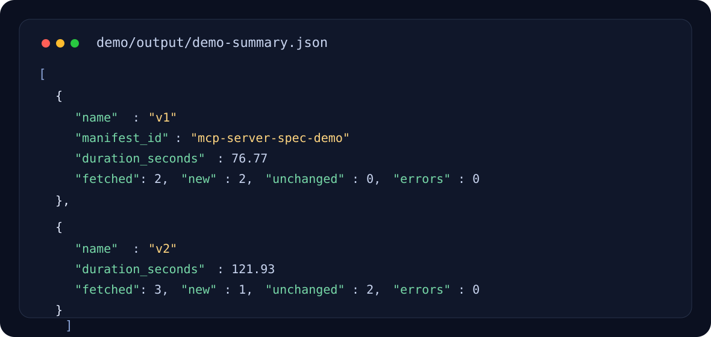
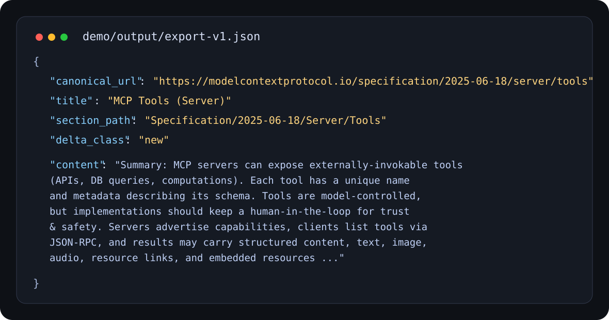

# crawl-to-knowledge-pipeline

Bound the crawl. Canonicalize the URL. Hash stable text locally. Let the model rewrite only the export layer.

This repo is a crawl control plane for documentation-heavy sources. It accepts a source manifest, fetches only declared URLs, normalizes each page into retrieval-ready records, diffs the run against the previous snapshot, and emits an export package another system can embed, index, or publish downstream.

Current scope:

- bounded frontier built from `seed_url` and `allowed_prefixes`
- deterministic URL canonicalization and content hashing
- Azure OpenAI extractor for dense technical record text
- run snapshots with `new`, `updated`, `unchanged`, and `deleted` counters
- FastAPI surface for run creation, inspection, and export retrieval
- checked-in live artifacts generated from the MCP server specification

What this is not:

- not a recursive spider
- not a browser renderer
- not a vector database
- not a queue-heavy distributed crawler

## Live Demo

The demo set in `demo/` was generated against the Model Context Protocol server specification using the live Azure extractor path with `gpt-5-mini`.

Observed run summary:

```json
[
  {
    "name": "v1",
    "manifest_id": "mcp-server-spec-demo",
    "duration_seconds": 76.77,
    "fetched": 2,
    "new": 2,
    "unchanged": 0,
    "errors": 0
  },
  {
    "name": "v2",
    "manifest_id": "mcp-server-spec-demo",
    "duration_seconds": 121.93,
    "fetched": 3,
    "new": 1,
    "unchanged": 2,
    "errors": 0
  }
]
```

Sample exported record:

```json
{
  "canonical_url": "https://modelcontextprotocol.io/specification/2025-06-18/server/tools",
  "title": "MCP Tools (Server)",
  "delta_class": "new",
  "section_path": "Specification/2025-06-18/Server/Tools"
}
```

Demo artifacts:

- `demo/input/manifest-v1.json`
- `demo/input/manifest-v2.json`
- `demo/output/run-v1.json`
- `demo/output/run-v2.json`
- `demo/output/export-v1.json`
- `demo/output/export-v2.json`
- `demo/output/demo-summary.json`

Rendered output snapshots:




## API

- `POST /api/crawls`: ingest a manifest and execute a crawl run immediately
- `GET /api/crawls/{run_id}`: inspect run status and counters
- `GET /api/sources`: list manifests seen by the service
- `POST /api/exports/build`: return the knowledge export package for a completed run
- `GET /healthz`: provider mode health check

The current storage layer is in-memory. Restarting the process clears run history.

## Why The Delta Logic Is Split

The model is not trusted with change detection.

`live_crawler.py` always computes `content_hash_sha256` from the deterministic local extractor, even in Azure mode. The Azure extractor only owns `title`, `content`, and `section_path` in the exported record. That keeps the diff stable across runs even when the model rewrites a paragraph differently.

If you push change classification into the model, this project stops being an ingestion system and turns into a hallucination surface.

## Run It

Install:

```bash
uv sync --extra dev
```

Start the deterministic API:

```bash
uv run uvicorn crawl_to_knowledge_pipeline.main:app --app-dir src --reload
```

Create a run:

```bash
curl -sS http://127.0.0.1:8000/api/crawls \
  -H "content-type: application/json" \
  -d @demo/input/manifest-v1.json
```

Build an export:

```bash
curl -sS http://127.0.0.1:8000/api/exports/build \
  -H "content-type: application/json" \
  -d '{"run_id":"crawl_replace_me"}'
```

## Azure Extractor Mode

```bash
export CRAWL_TO_KNOWLEDGE_PROVIDER=azure
export AZURE_OPENAI_ENDPOINT="https://<resource>.openai.azure.com/"
export AZURE_OPENAI_API_KEY="<key>"
export AZURE_OPENAI_API_VERSION="2025-04-01-preview"
export AZURE_OPENAI_EXTRACT_DEPLOYMENT="gpt-5-mini"

uv run uvicorn crawl_to_knowledge_pipeline.main:app --app-dir src --reload
```

Regenerate the checked-in live demo:

```bash
uv run python scripts/run_live_demo.py
```

Expect roughly 30 to 60 seconds per fetched page when using the live extractor path. This repo trades throughput for high-density exported records and stable diff boundaries.

Provider-specific notes live in `docs/azure-foundry.md`.

## Files Worth Reading

- `src/crawl_to_knowledge_pipeline/service.py`
- `src/crawl_to_knowledge_pipeline/live_crawler.py`
- `src/crawl_to_knowledge_pipeline/extractor_backend.py`
- `src/crawl_to_knowledge_pipeline/azure_extractor.py`
- `scripts/run_live_demo.py`
- `docs/architecture.md`
- `docs/runbook.md`

## Tests

```bash
uv run pytest -q
uv run python -m compileall src scripts
```
